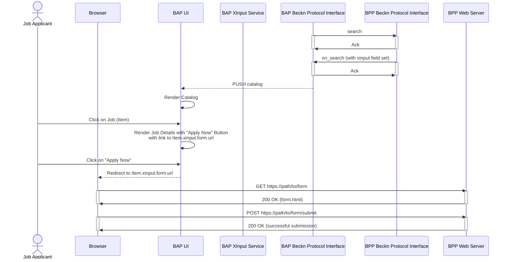
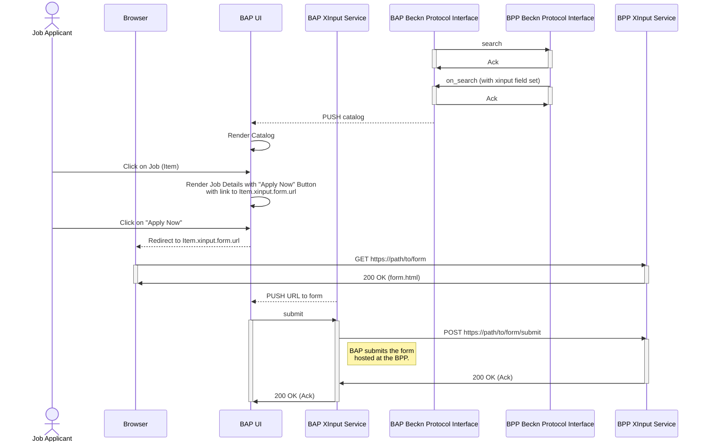

# The XInput Schema
## CWG Working Draft - July 10, 2023
# 1. Document Details
## 1.1 Version History
> Add Version History Table
## 1.2 Latest editor's draft
> Add link to draft
## 1.3 Implementation report
> Add link to implementation report

## 1.4 Stress Test Report
> Add link to stress test report

## 1.5 Editors
> Add list of editors

## 1.6 Authors
> Add list of authors
## 1.7 Feedback
### 1.7.1 Issues
> Add link to Issues

### 1.7.2 Discussions
> Add link to Discussions

### 1.7.3 Pull Requests
> Add link to Pull Requests

## 1.8 Errata
> Add link to Errata

# 2. Context
Beckn protocol defines a domain-agnostic specification that can be used to represent any customer- provider transaction by implementing a standard set of APIs and schema. Creating a transaction ideally involves the customer discovering products and services offered by various providers, selecting the desired products or services, obtaining the terms of service and payment, and then finally confirming the order. But sometimes,  the provider might require additional metadata in order to confirm a transaction. This requirement may be due to legal requirements imposed by the regulatory authorities, or business requirements to allow better serviceability. 

For example, a logistics service provider might require additional information from the logistics customer (like a restaurant) like the dimensions of the package, category of items (food, flammable, fragile etc), approximate weight of the package, the order Number etc,to confirm the order. All of this information needs to be transmitted to the person availing the logistics service. 

Similarly, a healthcare service might want the patient to provide information like, their medical history, a description of their symptoms, details of the insurance, etc, before confirming the order.  

The nature of additional information required could vary significantly across sectors. These fields could be varied and many, and adding them as protocol attributes would make the protocol bulky and cluttered. 

There is a need for a feature in beckn protocol that allows the BPP to capture additional information (over and above what has been published in the catalog) from the customer regarding the order without extending the core transaction protocol.

### Review Notes: Add Examples for
- Insurance
- Lending (KYC, Financial info)
- Jobs and skilling
- Airline ticket (traveller details, names, travel insurance, coupon code etc)


# 3. Description

The XInput schema is a container class that allows BPPs to create and transmit custom forms and their respective controls to the BAP. These forms are hosted by the BPP and are rendered on a BAP. The form submission happens off the network, i.e does not use beckn APIs. However the proof of form submission is transmitted using beckn API calls to enable the BPP to link a beckn transaction against a form submission.

Such a schema tremendously improves the flexibility of beckn protocol, enabling it to support millions of use cases that heavily rely on form submissions. This ensures that the core protocol remains lean and avoids sensitive data to be transmitted over the protocol.

# 4. Key Digital Functionalities

The XInput feature of the protocol MAY be implemented as a building block on the BAP and at the BPP respectively with different features. This section contains the key digital functionalities that MUST / SHOULD / MAY be supported by the implementation of the XInput schema.

## 4.1 Form Declaration (Applicable only for BPPs)

### 4.1.1 Recommendations for BPPs
The following recommendations contain features that a BPP must allow while implementing the XInput feature

- BPPs MUST be able to manage forms with varying degrees of complexity
- BPPs MUST be able to declare all form controls available to the user. For more information, refer to [W3C Form Controls](https://www.w3.org/TR/2002/WD-xforms-20020118/slice8.html) 
- BPPs MUST be able to explicitly declare that the form needs to be submitted in multiple steps. For example, to collect additional information from an applicant like Personal Details, Academic Details, Financial Information etc, before applying for a scholarship. For example, based on the form declaration by the BPP, a BAP must be able to render a form like the one shown below

- BPPs MUST be able to declare if the form can be natively rendered on a BAP or opened on a browser
- BPPs MUST be able to declare if a particular form can be submitted multiple times
- BPPs MUST be able to declare if a previously submitted form data can be edited and re-submitted
- In case of multi-step forms, the BPPs MUST be able to declare if a particular step allows the user to go back to the previous step
- BPPs MUST be able to digitally sign the form content to allow non-repudiability of the form structure
- BPPs MUST be able to host the form on a URL
- BPPs SHOULD be able to statically or dynamically link it to a catalog item or an entire order
#### Review Notes:
- Support for off-protocol contractual negotiations (back and forth). Explore if `XInput` is required. Or treat it as a separate problem statement. How is the negotiation attached to the contract / order. Ability to attach _Documents_ to the transaction MUST be supported
- Example: In exports, chat history must be attached
- Two-way form filling should be supported i.e on BAP side as well

## 4.2 Form Modeling 
Form modeling refers to the non-visible attribute of a Form that describes what a form does. It defines the individual model items and constraints and other run-time aspects of the form. Models are transmitted only when BPP is implementing XForms. This can be represented in the XForms model element, which in XHTML would typically be contained within the head section. Beckn protocol does not provide any recommendations for form modeling. BPPs can implement any model for a form behind the network interface. However, in some cases BPPs can choose to transmit the model along with the presentation that the BAPs can render and process before submission. 

### 4.2.1 Recommendations for BPPs
> Note: This functionality is applicable for BPPs that have implemented [W3C XForms standard] and want to transmit the model along with the forms
- BPPs MUST be able to create and model a form according to the recommendations published in the XForms specification

### 4.2.2 Recommendations for BAPs
> Note: This functionality is applicable for BAPs that have the capability to natively process XHTML documents
- BAPs should be able to render the form based on the model on their UI

## 4.3 Form Controls 
Controls are objects that display data or make it easier for users to enter or edit data, perform an action, or make a selection. In general, controls make the form easier to use. Examples of common controls include list boxes, option buttons, and command buttons.

### 4.3.1 Recommendations for BPPs
- BPPs should be able to add form control elements like text boxes, radio buttons, checkboxes, dropdown lists, sliders, etc as markup elements inside an HTML or an XHTML document

### 4.3.2 Recommendations for BAPs
- BAPs SHOULD be able to render the form controls by parsing the HTML or XHTML document

## 4.4 Form Transmission
Form Transmission refers to the interaction where a BAP fetches the form from its URL contained in the `XInput.form.url` property as shown in the image below


### 4.4.1 Recommendations for BPPs
- BPPs MUST be able to return an HTML or XHTML document when requested from a valid BAP
- In case of HTTP/S implementations, the BPP MUST return a HTML or XHTML document with the appropriate headers
- In case the form has expired, the BPP MUST send an HTML or XHTML document with a 404 status code
- In case the form is accessed by an unauthorized BAP, the BPP must send send an HTML or XHTML document with a 403 status code (for HTTP/S implementations)

### 4.4.2 Recommendations for BAPs
- BAPs MUST be able to fetch the form from the URL present in the `form.url` property of the `XInput` object
- BAPs MUST be able to verify the digital signature of the form using the public key of the BPP 

### Review Notes:  
- Transaction ID must be embedded in the form
- Should the form have an ID?
- What else? Is Form ID same as Transaction ID?
- BPP should also be able to fetch the form from the BAP
- Separate BAP, BPP authorization from user auth
- BAP must always send Signature header when accessing ANY url access. BPP may authenticate the BAP or not depending on nature of form
- ALL URLs that are embedded in the protocol must have a Signed token
  
## 4.5 Form Rendering (Applicable for BAPs)
### 4.5.1 Recommendations for BPPs
- TODO
### 4.5.2 Recommendations for BAPs
- TODO

## 4.6 Form Navigation
### 4.6.1 Recommendations for BPPs
- If form navigation is allowed, BPPs MUST be able to return the previous form with saved information when requested by a BAP
- If form navigation is NOT allowed, BPPs MUST be able to return an error with a message restricting the user from navigating
### 4.6.2 Recommendations for BAPs
- BAPs SHOULD allow the user to navigate from one step of the form to another if allowed by the BPP
- BAPs SHOULD NOT allow the user to navigate to navigate the form if NOT allowed by the BPP

## 4.7 Workflow Management
This functionality allows BAPs and BPPs to manage form workflows like Go Back, Skip, Save

### 4.3.1 Recommendations for BPPs
- BPPs MUST be able to specify the current state of a form submission workflow
- BPPs MUST be able to host the form on a URL and add it to a Form object
- In case of multi-step forms, BPPs MUST be able to add the total number of steps in the workflow 
- In case of multi-step forms, BPPs MUST be able to add the headings of each step
- In case of multi-step forms, BPPs MUST be able to specify the currently active step
### 4.3.2 Recommendations for BAPs
- BAPs SHOULD be able to render the form controls based on the information received in the XInput object
- BAPs SHOULD be able to navigate the form
- BAPs SHOULD be able to redirect the user to an external URL on a browser

## 4.8 Form Submission
### 4.7.1 Recommendations for BPPs
### 4.7.2 Recommendations for BAPs

# 5. Functional Recommendations

## 5.1 Form Declaration
### 5.1.2 Recommendations for BPPs
- BPPs that require additional information pertaining to individual items being ordered to confirm an order, must send the XInput object in the Item schema with a form object containing a link to the form with item-specific fields. For example, a person buying an airline ticket containing two flights - an onward Journey by Etihad and a return journey by Lufthansa might have to provide his Etihad membership code for his onward journey. For his return journey, Lufthansa might require them to declare their luggage dimensions, and upload a Covid-19 vaccination certificate. 
- If BPPs require additional information pertaining to the order as a whole, they must send the Xinput object in the Order schema containing a link to the form with order-specific information. For example, a cash on delivery grocery order from a store might require the store owner to declare the amount to be collected, the number of items, package category, and the weight of the package before placing the order. 
- If the form is cacheable, then it is recommended for BPPs to send the form link during on_search itself
- If the form is dynamic, then it is recommended for BPPs to send the form link during on_select, or on_init wherever applicable.

### 5.1.3 Recommendations for BAPs
## 5.2 Form Modeling
### 5.2.1 Recommendations for BPPs
- The XInput feature must contain two parts namely a) a header, b) a form

### 5.2.2 Recommendations for BAPs
## 5.3 Form Transmission
### 5.3.1 Recommendations for BPPs
- Before calling on_search, the XInput feature MAY attach an XInput object to the Item.xinput property
- Before calling on_select, the XInput feature MAY attach an XInput object to the Order.xinput property
### 5.3.2 Recommendations for BAPs
- Upon receiving an on_search, the BAP MUST first check if an Item object has an `xinput` property set. If it is set, then it must consume the Item.xinput property as an XInput object
- Upon receiving an XInput object in Item.xinput during on_search, the BAP must 
- Upon receiving an on_select, on_init, on_confirm, on_update, and on_cancel, request, the BAP MUST first check if the Order object has an `xinput` property set. If it is set, then it must consume the Item.xinput property as an XInput object


## 5.4 Form Rendering
### 5.4.1 Recommendations for BPPs
### 5.4.2 Recommendations for BAPs
## 5.5 Form Navigation
### 5.5.1 Recommendations for BPPs
- The XInput feature MUST allow BPPs to request for additional information related to a catalog item or an entire order via one or more forms. For example, BPPs should be able to collect additional information from an applicant like Personal Details, Academic Details, Financial Information etc, before applying for a scholarship.
- t MUST allow BPPs to specify if the BAP user needs to be redirected to an external web page to view the form
- It MUST allow BPPs to specify if there are multiple forms that need to be submitted
### 5.5.2 Recommendations for BAPs
- If SHOULD allow BAPs to fetch a form via a URL 
- If allowed, It SHOULD allow BAPs natively render the form to its user on its application 
- In case of multi-step forms, it SHOULD allow BAPs to render the headings of each of the steps of the form
- In case of multi-step forms, it SHOULD allow BAPs to navigate between the steps
## 5.6 Form Submission
### 5.6.1 Recommendations for BPPs
- It MUST allow form submissions from authenticated BAP hosts 
### 5.6.2 Recommendations for BAPs

# 6. Cross Cutting Requirements
## 6.1 Security Considerations

# 7. Data Model
The proposed design of this feature is as follows.

It starts with a schema called `XInput` of type `Form`. The definition of `Form` is also shown here among other relevant schemas.


```
 Item:
   type: object
   properties:
     xinput:
       $ref: XInput

 Order:
   type: object
   properties:
     xinput_required:
       $ref: XInput

 XInput:
   type: object
   properties:
     form:
       $ref: Form
     required:
       description: Indicates whether the form data is mandatorily required by the BPP to confirm the order. 
       type: boolean
       default: true

 Form:
   description: Describes a form that needs to be rendered to the BAP user before the confirmation of an order.
   type: object
   properties:
     url:
       description: The URL from where the form can be fetched. The content fetched from the url must be processed as per the mime_type specified in this object. The BAP can choose to render the form as-is as an embeddable element, or process it further to blend it with the style of the application. In case the interface is non-visual, the BAP can process the form data and reproduce it as per the UI requirements.
       type: string
       format: uri
     mime_type:
       description: This field indicates the nature and format of the form received by querying the url. MIME types are defined and standardized in IETF's RFC 6838. If the mime_type is text/html, the application must render it inside a web view. If the mime_type is application/xml, then the application must consider it as an xForms 2.0 object and render it as per the XForms 2.0 specification.
       type: string
       enum:
       - text/html
       - application/xml
     submission_id:
       type: string
       format: uuid

 FormResponse:
   description: Describes the response to a form submission
   type: object
   properties:
     status:
       description: Contains the status of form submission.
       type: boolean
       default: true
     submission_id:
       description: This contains a UUID generated by the BPP on successful submission of the form. 
       type: string
       format: uuid
     errors:
       type: array
       items:
         $ref: Error

 Error:
   description: Describes an error object returned by the API in case of an exception scenario. The exception may be a technical one like a schema or a signature verification error; or business-related like an item not found, or an agent not available.
   type: object
   properties:
     code:
       type: string
 	 description:For full list of error codes, refer to docs/protocol-drafts/BECKN-RFC-005-ERROR-CODES-DRAFT-01.md of this repo
     path:
       type: string
       description: Path to json schema generating the error. Used only during json schema validation errors
     message:
       type: string
       description: Human readable message describing the error. Used mainly for logging. Not recommended to be shown to the user.
   required:
     - code
     - path
```
## 7.1 XInput
## 7.2 Form
## 7.3 Examples
- An XInput object that contains a single form hosted on a URL. This form should open in a browser and not natively rendered on the BAP

# 8. Example Workflows
## 8.1 External Forms
In the following set of examples the BAP user has to go to an external website to fill and submit a form
### 8.1.1 : Discovery of a job and applying on employer's career portal
In this example, a BPP returns a catalog of jobs as a response to a `search` request. The Item object in the Job catalog will look like this.

```
{
    "id": "1",
    "description": {
        "name": "Software Development Engineer - I",
        "code": "SDE-1",
        "short_desc": "Job opening for a Senior Software Engineer"
    },
    "xinput": {
        "descriptor": {
            "name": "Apply Now"
        },
        "header": {
            "redirect": true
        },
        "form": {
            "url": "https://example.com/careers/sse-1/applyNow",
            "mime_type": "text/html"
        },
        "required": true
    }
}
```

#### Workflow



> Note : It is important to note that the BAP can render the application in a webview if the external webpage is mobile responsive. However it does come at the cost of user experience.

### 8.1.2 : Discovering and applying for a job natively on the BAP with single page form

#### Workflow



### Requesting BAP user to fill a form before selecting an item from the catalog using a single form hosted at a 3rd party URL with form controls on the BAP
```
{
    "head": {
        "descriptor": {
            "name": "Know Your Customer"
        },
        "index": {
            "min": 0,
            "cur": 2,
            "max": 2
        },
        "headings": [
            "Personal Information",
            "Financial Information",
            "Terms and Conditions"
        ],
        "prev_page": "",
        "resubmit": false,
        "submit_before": "select",
        "goback": "https://example.com/path/to/form.html?page=3"
    },
    "form": {
        "url": "https://example.com/path/to/form.html?page=3",
        "mime_type": "text/html",
        "signature": "Signature keyId='example-bpp.com|74b43deb-236e-4498-8f5a-ca75d6c67b9d|ed25519',algorithm='ed25519',created='1641287885',expires='1641287885',headers='(created) (expires) digest',signature=;hJ5sCmbe7s9Wateq6QAdBGloVSkLuLHWOXcRkzrMcVLthFldV4gnT9Vrnq9iDNPVSKuDqaercVjQwFlj0Ml+3Q=='",
        "nonce": "q6QAdBGloVSkLuLHWO",
        "method": "POST"
    }
}
```
## Requesting additional information from a BAP user before selecting multiple items from the catalog using a multiple forms
## Requesting additional information from a BAP user before initializing an order
## Requesting additional information from a BAP user before confirming an order
## Requesting additional information from a BAP user after confirming an order
## Requesting additional information from a BAP user before canceling an order
## Requesting additional information from a BAP user before updating an order
## Requesting feedback from a BAP user after receiving rating


> Everything below this line is draft

## This version

&lt;to be added later>


## Latest published version

&lt;to be added later>


## Latest editor's draft

&lt;to be added later>


## Implementation report

&lt;Useful thing to have but will be added later>


## Editors

Ravi Prakash (FIDE)


## Authors

Ravi Prakash (FIDE)


## Feedback

Issues:

Discussions

PRs


## Errata

No Errata exists as of now


# 2. Authors


1. Ravi Prakash


# 3. Context


# 4. Problem Description


# 5. Key Digital Functionalities


## 5.1 Form Declaration


### 5.1.1 Recommendations for BPPs


## 5.2 Form Modeling


### 5.2.1 Recommendations For BPPs


1. Add something here


### 5.2.2 Recommendations For BAPs


1. Add something here


## 5.3 Form Submission


### 5.3.1 Recommendations For BPPs


1. Add something here


### 5.3.2 Recommendations For BAPs


1. Add something here


## 5.4 Form Navigation


### 5.4.1 Recommendations For BPPs


### 5.4.2 Recommendations For BAPs


# 6. Functional Recommendations


## Form Declaration


* 


## Form Modeling


## Form Transmission

For BPPs


1. 

For BAPs


1. 


## Form Fetching


2. 


## Form Submission


1. Upon receiving a form submission, the XInput feature must generate a unique submission ID


## Form Navigation


# Data Model


# Workflows


## Recommendations for BPPs

The following recommendations are for BPPs who will create the form to be rendered on BAPs and receive the submissions from it. 


### Declaring the form


* 


### Modeling the form


* BPPs can model the form in two ways namely, a) using HTML5 Forms, or b) xForms 2.0 objects
* For creating HTML Forms, please refer to [this](https://www.w3schools.com/html/html_forms.asp) tutorial
* For creating xForms 2.0 Forms, please refer to [this](https://www.w3.org/TR/xforms20/) specification
* Networks can mandate only one, or both types of form specification. (For new networks, it is recommended to start with HTML forms)
* For HTML forms the submission url will be present in the action attribute of the form tag as highlighted in the example below

    &lt;form **action="http://example.com/submitForm" method=”post”**> … &lt;/form>

* For xForms 2.0 forms, the submission url will be present in the action attribute of the xform:submissions tag as highlighted in the example below

    &lt;xforms:submission **action="http://example.com/submitForm"** **method="post"** includenamespaceprefixes=""/>

* It is _not recommended_ for BPPs to send `script` tags along with HTML forms as it will pose a security concern for BAPs
* It is _not recommended_ for BPPs to send `style` tags along with HTML forms as BAPs may re-render the form as per their UI
* It is _not recommended_ for BPPs to send `button` tags along with HTML forms as BAPs may render the CTA for form submission according to their UI
* For XForms 2.0 submissions, the BPP can send the &lt;xforms:submission /> tag to specify submission URL, but it will not be rendered at the BAP. 


### Handling form requests


* The form must be hosted on a trusted url, preferably with the same domain name as the BPP’s subscriber_id to avoid security-related errors thrown by BAPs. 
* When requested on HTTP, the BPPs must return Content-type: text/html or application/xml in the response body headers. 
* It is _recommended_ to send a unique nonce value in UUID format whenever it receives a form request from a BAP and persist it until a submission matches the nonce or the form expires


### Handling form submissions


* The form submission method must always be a HTTP/POST when using HTTP as a transport layer. Example: `&lt;form action="url" method="post">`
* The form submission API must also be on the same domain name as the BPP subscriber_id to avoid security-related errors thrown by BAPs
* Form submission request should be digitally signed by the BAP
* The following algorithm must be executed at the BPP when the form is submitted on HTTP/POST, 
* Check if signature is valid
* Check if the nonce value exists and is not expired
* If the nonce value exists and is not expired
    * Validate the form inputs
    * Generate a **FormResponse** object and return it as a application/json response
* BPPs must persist this UUID at their ends so that they can match each submission with the corresponding confirm API call


### Linking form submission to existing transactions


* After successful form submissions, the BPP should ideally receive a confirm API call containing references to the submissions.
* The form submission references can be found in Order.items[ ].xinput_required.form.submission_id, and Order.xinput_required.form.submission_id fields.


### Discarding Form Submissions


* The BPP can choose to discard the form submissions if the confirm API call does not arrive within a specified time window after the form has been submitted


## Recommendations for BAPs

The following recommendations are for BAPs who will render the form to its users and send the submissions to the BPPs. 


### Identifying form declarations


* BAPs can identify required item-specific form inputs by parsing the Item schema received in on_search callbacks.
* BAPs must also check for required order-specific form inputs by parsing the Order schema received in on_select, and on_init callbacks.
* The BAP may choose to cache the form by calling the `{Item}.xinput.form.url` endpoint from its API endpoint.
* It should expect either an HTML or an Xforms 2.0 object as a response. If the response body header has Content-type: text/html, then it should expect an HTML form object. If it is application/xml, it should expect an xForms 2.0 model object.


### Rendering the form


* BAPs should render their forms typically any time before confirming the order
* For item-specific inputs, BAPs should typically render the form when the user selects the item for ordering
* For order-specific inputs, BAPs should typically render the form
* BAPs should remove any script, style, and button tags when rendering the form inside their own UI


### Submitting the form


* BAPs should submit the form data on the submission url specified in the form object via a HTTP/POST request.
* For HTML forms the submission url will be present in the action attribute of the form tag as highlighted in the example below

    &lt;form **action="http://example.com/submitForm" method=”post”**> … &lt;/form>

* For xForms 2.0 forms, the submission url will be present in the action attribute of the xform:submissions tag as highlighted in the example below

    &lt;xforms:submission **action="http://example.com/submitForm"** **method="post"** id="submit" includenamespaceprefixes=""/>

* When submitting the form, the BAPs must _digitally sign_ the request body in the request header
* All form submissions must be digitally signed by the BAP


### Handling form submission responses


* Form responses are received in the **FormResponse** object
* The FormResponse object contains status, submission_id and an error array
* After receiving the form response, the BAP should execute the following algorithm

    If FormResponse.status is true


    	save the submission_id


    Else


    	throw an exception based on the data inside the error object


### Post-Form Submission

After successful submission of the form, the BAP must ideally, send the submission_id received in the previous submission and send it in the corresponding item’s xinput.form.submission_id field, in the confirm API.


# Examples


### Example 1 : A logistics provider wants additional information on the nature of the package just before placing the order

In this example, the Logistics BPP can create a XInput object containing a link the the following form


```
   <form action="https://api.example-bpp.com/sendPackageDetails" method="post">
     <label for="itemCount">Number of items</label>
     <input type="number" id="itemCount" name="itemCount" value="0" />
     <label for="plength">Package length in cm</label>
     <input type="number" id="plength" name="plength" value="0" />
     <label for="pwidth">Package width in cm</label>
     <input type="number" id="pwidth" name="pwidth" value="0" />
     <label for="pheight">Package height in cm</label>
     <input type="number" id="pheight" name="pheight" value="0" />
     <label for="itemCategory">Select your degree</label>
     <select name="itemCategory" id="itemCategory">
       <option value="fnb">Food and Beverages</option>
       <option value="bns">Books and Stationery</option>
       <option value="etg">Electronic Goods</option>
       <option value="hhg">Household goods</option>
     ><br/><br/>
     <input type="hidden" id="nonce" name="nonce" value="t8923y4ryu328473y4" />
   </form>
```


Let us assume this form is hosted at - https://api.example-bpp.com/getForm?id=t8923y4ryu328473y4

The BPP can choose to send this form at an Item level or at an order level. To keep things simple, let us send this form at an order level.

Let us assume, the Logistics BAP has already declared the intent (via search), received the catalogs (via on_search), selected a specific item ( via select), and has received a quote(via on_select).


### Form identification

When the Logistics BAP calls init, the Logistics BPP sends the following order object


```
{
   "context" : {
       "action" : "on_init",
       ...// other context details
   },
   "message" : {
       "order" : {
           "items" : [
               {
                   "id" : "4aa3feca-96b5-47dd-a233-f7fd2525922c",
                   "descriptor" : {
                       "name" : "Hyperlocal delivery"
                   },
                   "price" : {
                       "value" : "50",
                       "currency" : "INR"
                   }
               }
           ],
           "xinput" : {
               "form" : {
                   "url" : "https://api.example-bpp.com/getForm?id=t8923y4ryu328473y4",
                   "mime_type" : "text/html"
               }
           },
           "billing" : {
               ...// billing details
           },
           "fulfillment" : {
               ...// fulfillment details
           },
           ...// other order level details
       }
   }
}
```


### Form Fetching from BPP

When the Logistics BAP receives this object via on_init, it must pull the form data from the order.xinput.form.url field and render the form on the UI. It is recommended that the Logistics BAP keeps watching for the xinput field at the item and order level. 


### Form Rendering on the BAP

Once pulled the BAP can render the form as-is on its UI, but it is not recommended, as doing so would result in a sub-optimal user experience. This is how the form will look if the BAP renders the form as-is using an HTML parser.


<p id="gdcalert1" ><span style="color: red; font-weight: bold">>>>>>  gd2md-html alert: inline image link here (to images/image1.png). Store image on your image server and adjust path/filename/extension if necessary. </span><br>(<a href="#">Back to top</a>)(<a href="#gdcalert2">Next alert</a>)<br><span style="color: red; font-weight: bold">>>>>> </span></p>


However, the BAP application can apply any styling framework (like css) on the form and render it as per the style guide of the application. 

This form must be rendered just before firing the confirm API.  This is typically just before checkout, when the BAP invokes the payment flow. 

The BAP must render the submit button for this form. This submit button functionality can be merged with the final checkout button or placed exclusively for this form as part of a two-step process. 

For example, in the case of a two step process, the flow might look like this


* Step 1: 
    * 1.1 Render form with the first button
    * 1.2 Capture form data and submit it to BPP
    * 1.3 Save submission_id if submission is successful
* Step 2: 
    * 2.1 Render the final confirmation screen with final checkout button
    * 2.2 Fire confirm along with the submission_id reference in the order object

In the case of a one step process,

In any case, the form submission id must be transmitted along with the confirm API call.

The BPP will receive the confirm call with the submission_id as reference. It will verify the submission against the submission_id and link that data along with the confirm API.

Now the BPP has all the information required to confirm the order. It can either go ahead with the confirmation or reject the request if applicable. 


### Example 2: A health & wellness service provider wants additional information about the patient before confirming a teleconsultation appointment. The provider and customer are on apps that are DHP-enabled (beckn protocol for health and wellness). 

&lt;add example>


### Example 3: A recruitment agency wants additional information about the candidate before confirming a job application. The provider and customer are on apps that are DSEP-enabled (beckn protocol for education and skilling). 

&lt;add example>


# Acknowledgements

The authors would like to thank the following people for their support and contributions to this document. 


* Venkataramanan Mahadevan
* Pramod Varma
* Sujith Nair
